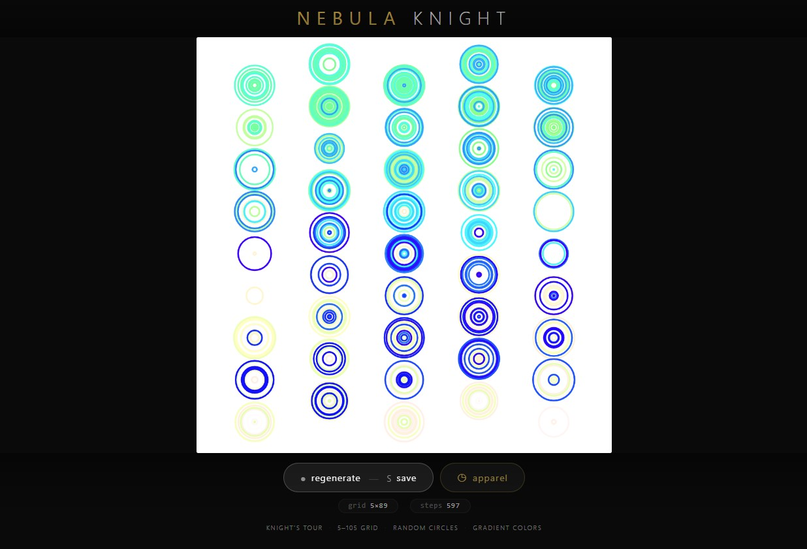
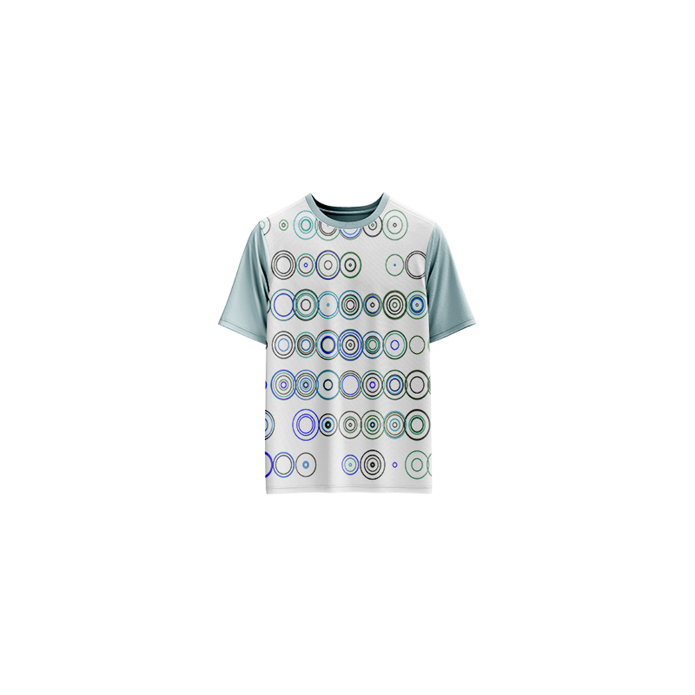

# Nebula Knight — Generative Art

[](https://reyrove.github.io/Nebula-Knight-Generative-Art)
[](https://opensource.org/licenses/MIT)

> **Generative knight's tour art with nebula gradients.** Each refresh creates a unique path of a knight's journey across a grid, drawing beautiful gradient circles that resemble a cosmic nebula.

## 🎨 Live Demo

<div align="center">
  <a href="https://reyrove.github.io/Nebula-Knight-Generative-Art" target="_blank">
    
  </a>
  <br><br>
  <a href="https://reyrove.github.io/Nebula-Knight-Generative-Art" target="_blank">
    
  </a>
  <br>
  <em>Click the image or button to experience the generative art</em>
</div>

## 👕 Apparel Preview

<div align="center">
  
  <br>
  <em>Nebula Knight artwork printed on a T-shirt</em>
</div>

## ✨ Features

- **Knight's Tour** — Random knight moves across a grid
- **Nebula Gradients** — 5 stunning color modes (Black, Blue, Cyan, Magenta, Yellow to White)
- **Random Circles** — Each position features a circle with random radius
- **Grid-Based** — 5×5 to 105×105 grid size
- **Gradient Colors** — Smooth HSB color transitions
- **Seed-Based** — Every composition is unique and reproducible
- **Save & Share** — Download as PNG
- **Apparel Mode** — Preview artwork on a T-shirt mockup
- **Responsive** — Works on desktop, tablet, and mobile
- **Pure p5.js** — Built with the creative coding library
- **Keyboard Shortcuts**:
  - `R` — Regenerate
  - `S` — Save image
  - `T` — Toggle apparel view

## 🎨 Artwork Details

| Parameter | Range | Description |
|-----------|-------|-------------|
| **Grid Size** | 5×5 to 105×105 | Knight's tour grid dimensions |
| **Step Size 1** | 1 to grid/5 | First knight move step |
| **Step Size 2** | 1 to grid/5 | Second knight move step |
| **Total Steps** | 10 to 1010 | Number of moves |
| **Start Position** | Random | Starting point on grid |
| **Color Modes** | 5 options | Black, Blue, Cyan, Magenta, Yellow to White |

## 🎯 Color Modes

| Mode | Colors | Description |
|------|--------|-------------|
| **0** | Black → White | Classic grayscale nebula |
| **1** | Blue → White | Cool cosmic blue nebula |
| **2** | Cyan → White | Ethereal cyan nebula |
| **3** | Magenta → White | Vibrant magenta nebula |
| **4** | Yellow → White | Warm golden nebula |

## 🚀 Quick Start

### Local Development

```bash
# Clone the repository
git clone https://github.com/reyrove/Nebula-Knight-Generative-Art.git

# Navigate to the directory
cd Nebula-Knight-Generative-Art

# Open in browser
open index.html
# or use a live server
```

### Deploy to GitHub Pages

1. Push to GitHub
2. Go to Settings → Pages
3. Select branch `main` and root folder
4. Your site will be live at `https://reyrove.github.io/Nebula-Knight-Generative-Art`

## 🧠 How It Works

The artwork is generated using a deterministic random number generator, seeded by timestamp + random noise. Every refresh:

1. **Setup**:
   - Random grid size (5-105)
   - Random step sizes (s1, s2) for knight moves
   - Random starting position
   - Random number of steps
   - Random color mode (5 options)

2. **Knight's Path**:
   - Start at random position on grid
   - Each step moves in an L-shape (knight move)
   - Step sizes (s1, s2) determine the L-shape dimensions
   - Path continues until steps run out or no valid moves remain

3. **Rendering**:
   - White background
   - Each position gets a circle with random radius
   - Color gradient from start color to white
   - Creates a nebula-like effect

## 📁 File Structure

```
Nebula-Knight-Generative-Art/
├── index.html          # Main application (all-in-one)
├── Nebula-Knight.jpg   # T-shirt mockup image
├── fav.svg             # Favicon
├── demo-screenshot.jpg # Website demo screenshot
├── README.md           # This file
└── LICENSE             # MIT License
```

## 🛠️ Tech Stack

- **p5.js** — Creative coding library
- **Canvas API** — 2D rendering
- **CSS Flexbox/Grid** — Responsive layout
- **GitHub Pages** — Hosting

## 🎯 Interactive Controls

| Action | Keyboard | Button |
|--------|----------|--------|
| Regenerate | `R` | Click "regenerate" |
| Save Image | `S` | Click "regenerate" |
| Toggle Apparel | `T` | Click "apparel" |

## 🎨 The Creative Process

### Knight's Tour
The knight's tour is a classic chess problem where a knight visits every square on a board exactly once. This artwork takes inspiration from that concept, creating unique paths with random step sizes and directions.

### Nebula Gradients
Each color mode transitions from a vibrant color to pure white using HSB interpolation, creating a beautiful nebula-like effect across the knight's path.

### Random Circles
Each position on the knight's path features a circle with a random radius, creating a dynamic, cosmic feel reminiscent of stars and nebulae.

### Step Sizes
The knight uses two step sizes (s1, s2):
- Random values create unique patterns
- Each combination produces different path shapes

## 📱 Responsive Design

The application automatically adapts to:
- Desktop screens
- Tablets
- Mobile phones
- Landscape orientation
- Various aspect ratios

## 🤝 Contributing

Contributions are welcome! Feel free to:
- Fork the repository
- Create a feature branch
- Submit a pull request

### Ideas for Contributions:
- New color modes
- Additional movement patterns
- Animation features
- Interactive controls
- Performance optimizations

## 📄 License

MIT License — see [LICENSE](LICENSE) file for details.

## 🙏 Acknowledgments

- Created with p5.js
- Inspired by the knight's tour problem
- Special thanks to the creative coding community

---

**Built with ❤️ and nebula dreams**